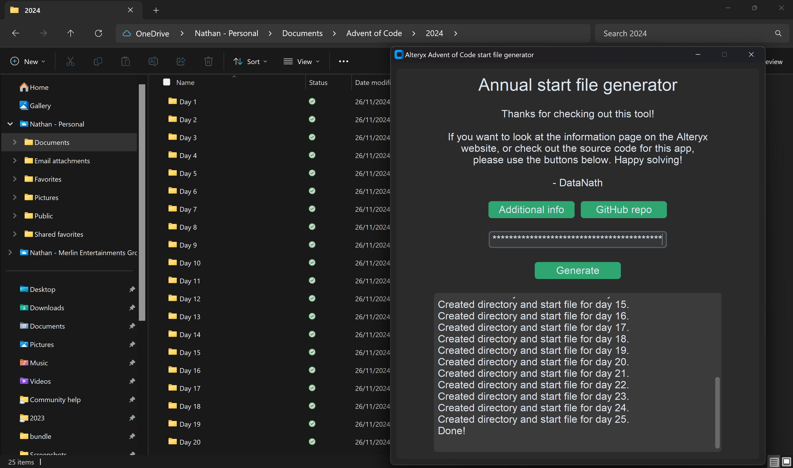

# AoC_startFile_gen

Download the latest version [here](https://github.com/DataNath/AoC_startFile_generator/releases/download/v1.0.0/AoC_startFile_gen.zip)!

### What this file does:

1. Takes a user input for your [Advent of Code](https://adventofcode.com/) session cookie value
2. Generates a year directory next to the .exe save location
3. Generates subdirectories for days 1-25
4. Creates a populated start file within each relevant subdirectory

<strong style="font-size: 24px;";>Set up:</strong>

>
To download the current release, simply click the link above.
**Note:** Browsers like Chrome may block the download. You can override these settings in most cases, as shown below. Of course, it is recommended to only do this if you trust the source & should be re-enabled after downloading.

After downloading, extract the .zip file.

Move the extracted .exe file to wherever you want to generate your start files. Likely a dedicated 'Advent of Code' directory to keep things organised! Once moved, simply run the application and wait for it to load. Be patient, this may take a few seconds.

You may also need to grant an exception on the file depending on your local antivirus/firewall settings, as the application is unsigned.

<strong style="font-size: 24px;";>How do I get my session cookie?:</strong>

>
To get your session cookie, head to the Advent of Code [website](https://adventofcode.com/) and sign in. Once signed in, you can right-click and inspect the page, or navigate to developer tools. Here, look in the 'Application' tab, click on 'session' and you'll be able to copy your session cookie value.

**Important** Do not share this with others - this grants access to act as your account associated with the website!

<strong style="font-size: 24px;";>Output:</strong>

>
If the application runs successfully, you'll receive everything listed above, which should look like:

Year directory:

DayN directories:

Start files:

<strong style="font-size: 24px;";>How does it work?:</strong>

>
There is a template.yxmd file within the bundle which is treated as such:
- Dummy `session_cookie` is replaced - taken from user input
- URL value `year` is replaced - parsed from today()
- URL value `day` is replaced - from range 1-25

Note: Given `year` is generated from today(), this app ought to be dynamic for future events!

(<a href="#readme-top">Back to top</a>)
